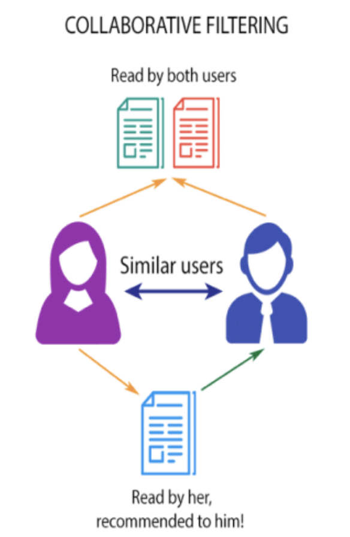

# Movie Recommendation

I am taking a shot at building a movie recommendation system.
The objective of this is to recommend a movie and streaming service depending on
user information, such as the ratings for movies they have given. I would love
to work towards making this recommender system implementable on a phone or
web application.

# The Data
The data comes from the movielens data <a href='https://grouplens.org/datasets/movielens/'>
    *here*
</a>. I am using the smaller dataset
consisting of about 100,000 ratings with 600 users. The including information
will be user ID, movie ID, tags, genres, and some timestamps. While working
through our final model I will make 2 subsets from our dataset. One will be a
train set where our model uses this information to make predictions. Our second
set will be a train set that I won't touch until the end. This will be to see
how the model does with predictions with information it hasn't seen before.

# Approach
The surprise package for python is very useful for building recommendation systems.
We will run a variety of models:
1. Basic models in the surprise package
2. k-NN inspired models
3. Matrix Factorization models

You can find out a little more about them <a href='https://surprise.readthedocs.io/en/stable/prediction_algorithms_package.html'>
*here*</a>.

This model will be a collaborative-filtering based model. It will make recommendations
based on other user data.

# Current Conclusion
We are choosing our model based mostly on Root Mean Squared Error(RMSE). What the models are doing
are that they are a taking a small test set of our data and treating this
as information it hasn't seen before. It makes predictions based on a training
set, information we use to 'train' our models. For our test set, it makes
predictions on what ratings users would give movies and then checks the error on
the prediction against the actual rating the user gave. This means that the lower
the RMSE the better our model does.

After running several models and judging based on RMSE, SVD++ is our current
best model. While SVD makes predictions based on other user ratings, SVD++ takes
this a step further by also taking into account which movies users have submitted
a rating to, regardless of the rating. After splitting our data between a train
and test set, we get an RMSE of .4911. Our movie recommender does a well enough
job in predicting which movies users will most likely enjoy.

| Algorithm | RMSE |
| -- | -- |
| Normal Predictor | 1.421790294040056 |
| Baseline Only | 0.8725156067406484 |
| KNN Basic | 0.9467594139423179 | 
| KNN with Means | 0.8962132182696518 | 
| KNN with Z-score | 0.8943579951002167 | 
| KNN Baseline | 0.873053202343454 | 
| SVD | 0.8732820832018253 | 
| *SVD pp* | *0.8609917633484961* |
| NMF | 0.9224528298044357 | 

### Quick Example
Let's take my household cat, Monkey, and have her rate a few of the movies in our
database. Taking a peek at few of the movies she enjoys, we get:
* Seven
* Usual Suspects
* Taxi Driver
* Before Sunrise
* Natural Born Killer

Taking a quick peek shows us that, for the most part, Monkey loves her crime, thriller,
and drama movies. We'll take all her ratings and generate a list of movies in an order
of movies she'd like the most to movies she'd like the list. Again, taking a look
at some of the movies she'd most likely enjoy, we get:
* Wild Tales
* Singin' in the Rain
* Lawrence of Arabia
* Rosemary's Baby
* The Hustler

After this quick peek, we see that some of these movies do include the genres
Monkey loves: crime, drama, and thriller. However, we do get some comedy and
romance thrown in, most likely influenced from the other movies Monkey decided
to rate.

# Next Steps
Since our system is recommending movies to users, I would love to be able to
give them feedback as to which streaming platform they can find their movie of
choice. I will most likely have to webscrape this information to provide the
necessary labels for each movie. 

My next approach will be to create a new column
of tags that a user gave for each movie. I will then encode this information
and the genres in order to create a new model that also compares users based on
genres they enjoy and tags they make.

I want to be able to enhance user experiences by giving them a customized
search experience. My plan is to help them narrow down movie choices by genre, years, 
streaming platform, and more.

Once all the above is said and done, I will incorporate this into the large dataset
consisting of over 27 million ratings, 58 thousand movies, and 280 thousand users.